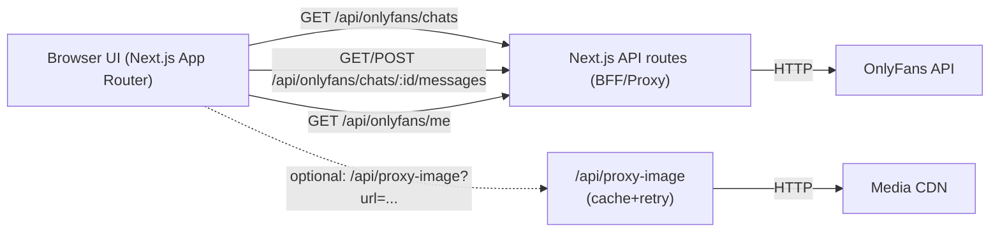
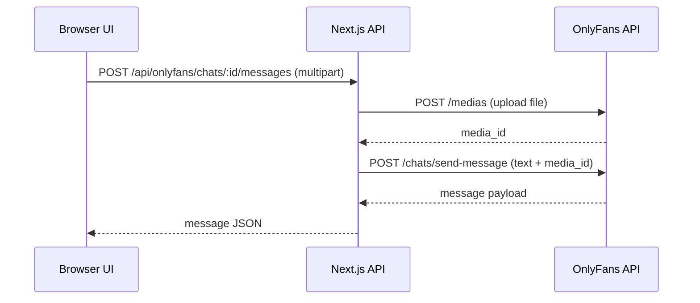

# OnlyFans Chat Prototype — Next.js BFF

## English

A web client for reading and sending OnlyFans messages through a server-side proxy (BFF). Focused on external API integration, media handling, pagination, and resiliency.

### Features
- Chat list and message history with `next_id` pagination
- Text + media sending (two-step upload)
- Optimistic UI updates + error handling
- Local message cache + deduplication
- Media proxy with caching, timeouts, and retries
- UI built on Radix/shadcn + Tailwind

### Demo


### Architecture


### Backend Architecture & Modules
- `src/app/page.tsx` — orchestrator: auth, chat load, message cache, pagination, optimistic send.
- `src/app/chat/[chatId]/page.tsx` — dedicated chat screen with input and "load older" action.
- `src/app/model/auth/page.tsx` — model auth UI with status polling.
- `src/app/api/onlyfans/[...path]/route.ts` — universal proxy to external API, plus `GET /me` and a stub `authenticate`.
- `src/app/api/onlyfans/chats/[chatId]/messages/route.ts` — server logic for messages/media: upload → media_id → send-message.
- `src/app/api/proxy-image/route.ts` — image proxy with cache, timeout, and retries.
- `src/lib/onlyfans-api.ts` — client layer + DTOs (typing, mapping, normalization).
- `src/lib/api-utils.ts` — HTTP response/error handling.
- `src/components/*` — UI components (`MessageItem`, `ChatInput`, `LoadingSpinner`).
- `src/components/ui/*` — base primitives (Radix/shadcn).

### Data & API Flow
- `GET /api/onlyfans/chats` → chat list, map fan data to `Chat`.
- `GET /api/onlyfans/chats/:id/messages?limit=&next_id=` → history + cursor pagination.
- `POST /api/onlyfans/chats/:id/messages`:
  - `multipart/form-data`: upload to `/medias`, get `media_id`, send to `/chats/send-message`.
  - `application/json`: text message only.
- Message cache by `chatId` + dedup by `id`, time-based sorting.
- Optimistic message insert and replacement after server confirmation.
- Mock fallback on external API failures (UI resilience).

### Design Patterns Used
- Backend-for-Frontend / API Gateway: server routes hide keys and normalize external API.
- Adapter / Mapper: transform external responses into `Chat` / `Message`.
- Cache-aside: in-memory image cache in `/api/proxy-image`, client message cache.
- Retry with backoff + timeout: resilience on media fetch.
- Optimistic UI: show messages before server response.
- Cursor pagination: history load via `next_id`.

### Backend Experience Highlights
- Built a BFF layer with Next.js API routes to integrate an external service.
- Implemented two-step media sending (upload → message).
- Designed pagination and local caching to reduce API calls.
- Added resilience (retries, timeouts, mock fallback).
- Implemented robust loading/error states in UI.

### Reliability & Performance
- Timeouts and limited retries for external media requests.
- 24-hour in-memory image caching to reduce load.
- Message deduplication by `id` during history load.
- Local sorting for predictable render order.

### Sequence: Media Message Flow


### Project Structure
```
src/
  app/
    api/
      onlyfans/[...path]/route.ts
      onlyfans/chats/[chatId]/messages/route.ts
      proxy-image/route.ts
    chat/[chatId]/page.tsx
    model/auth/page.tsx
    page.tsx
  components/
  lib/
docs/demo.gif
```

### Run
1. `npm install`
2. `npm run dev`
3. Open `http://localhost:3000`

### Future Improvements
- Move API keys to `.env` and add typed config.
- Add rate limiting and audit logging for API routes.
- Use persistent cache (Redis) for images and message history.
- Add e2e tests for media sending scenarios.

---

## Русский

Веб‑клиент для чтения и отправки сообщений OnlyFans через server‑side прокси (BFF). Фокус — архитектура интеграции внешнего API, обработка медиа, пагинация и устойчивость.

### Возможности
- Список чатов и история сообщений с пагинацией `next_id`
- Отправка текста и медиа (двухэтапная загрузка)
- Оптимистичные обновления UI + обработка ошибок
- Локальный кэш сообщений и дедупликация
- Прокси медиа с кэшированием, таймаутами и ретраями
- UI на основе Radix/shadcn + Tailwind

### Демонстрация


### Архитектура


### Архитектура и модули
- `src/app/page.tsx` — orchestrator: авторизация, загрузка чатов, кэш сообщений, пагинация, оптимистичная отправка.
- `src/app/chat/[chatId]/page.tsx` — отдельный экран чата с инпутом и кнопкой загрузки старых сообщений.
- `src/app/model/auth/page.tsx` — UI авторизации модели с polling статуса.
- `src/app/api/onlyfans/[...path]/route.ts` — универсальный прокси к внешнему API, плюс `GET /me` и stub `authenticate`.
- `src/app/api/onlyfans/chats/[chatId]/messages/route.ts` — серверная логика сообщений и медиа: upload → media_id → send-message.
- `src/app/api/proxy-image/route.ts` — проксирование изображений с кэшем, таймаутом и ретраями.
- `src/lib/onlyfans-api.ts` — клиентский слой и DTO (типизация, маппинг, нормализация).
- `src/lib/api-utils.ts` — обработка HTTP‑ответов и ошибок.
- `src/components/*` — UI‑компоненты (`MessageItem`, `ChatInput`, `LoadingSpinner`).
- `src/components/ui/*` — базовые primitives (Radix/shadcn).

### Работа с API и логикой данных
- `GET /api/onlyfans/chats` → список чатов, маппинг фан‑данных в `Chat`.
- `GET /api/onlyfans/chats/:id/messages?limit=&next_id=` → история сообщений + cursor pagination.
- `POST /api/onlyfans/chats/:id/messages`:
  - `multipart/form-data`: загрузка файла в `/medias`, получение `media_id`, отправка сообщения в `/chats/send-message`.
  - `application/json`: текстовое сообщение без медиа.
- Кэш сообщений по `chatId` + дедупликация по `id`, сортировка по времени.
- Оптимистичное добавление сообщения и последующая замена на подтверждённые данные.
- Фолбэк на mock‑данные при ошибках внешнего API (устойчивость UI).

### Используемые паттерны и приёмы
- Backend‑for‑Frontend / API Gateway: серверные маршруты скрывают ключи и нормализуют внешний API.
- Adapter / Mapper: преобразование ответов внешнего API в `Chat` / `Message`.
- Cache‑aside: in‑memory кэш изображений в `/api/proxy-image`, клиентский кэш сообщений.
- Retry with backoff + timeout: устойчивость при загрузке медиа.
- Optimistic UI: мгновенное отображение сообщения до ответа сервера.
- Cursor pagination: загрузка истории по `next_id`.

### Backend‑ориентированный опыт
- Построил BFF слой на Next.js API routes для интеграции внешнего сервиса.
- Реализовал двухэтапную отправку медиа (upload → message).
- Спроектировал пагинацию и кэш сообщений для уменьшения числа запросов.
- Добавил устойчивость к сбоям (ретраи, таймауты, mock fallback).
- Проработал обработку ошибок и состояния загрузки в UI.

### Надёжность и производительность
- Таймаут и ограниченное число повторов для внешних запросов медиа.
- Кэширование изображений на 24 часа для снижения нагрузки.
- Дедупликация сообщений по `id` при подгрузке истории.
- Локальная сортировка сообщений для предсказуемого рендера.

### Поток отправки сообщения с медиа


### Структура проекта
```
src/
  app/
    api/
      onlyfans/[...path]/route.ts
      onlyfans/chats/[chatId]/messages/route.ts
      proxy-image/route.ts
    chat/[chatId]/page.tsx
    model/auth/page.tsx
    page.tsx
  components/
  lib/
docs/demo.gif
```

### Запуск
1. `npm install`
2. `npm run dev`
3. Открыть `http://localhost:3000`

### Идеи для развития
- Вынести API‑ключи в `.env` и добавить типизированную конфигурацию.
- Добавить rate limiting и audit‑логирование для API‑маршрутов.
- Персистентный кэш (Redis) для изображений и истории сообщений.
- Набор e2e‑тестов для сценариев отправки медиа.
